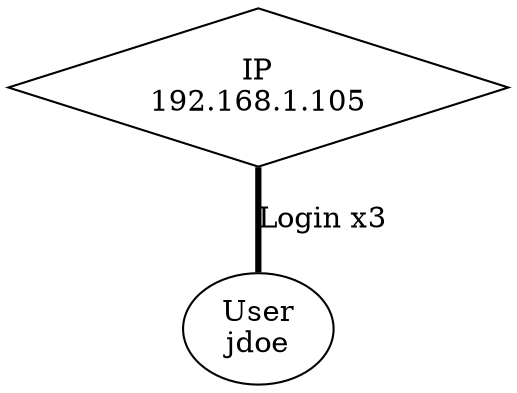

# SPRINTS_v3.md — STRATA AUTONOMOUS BUILD QUEUE
# Drop this file in ~/Wolfmark/strata/ alongside CLAUDE.md
# Usage: "Read CLAUDE.md and SPRINTS_v3.md. Execute all incomplete sprints in order.
#         For each sprint: implement, test, commit, then move to the next."
# Last updated: 2026-04-16
# Prerequisite: All SPRINTS.md and SPRINTS_v2.md sprints complete
# Focus: Category 2 — Examiner Experience
#         Reporting, Chain of Custody, Workflow, Visualization,
#         Intelligence Integration, Legal Compliance, Field Use
#
# AIR-GAP REQUIREMENT: Every sprint in this file must work on a fully
# air-gapped forensic computer with zero network access. No external API
# calls, no CDN dependencies, no cloud lookups. All data sources are either
# bundled in the binary or imported manually by the examiner from a file.
# This is non-negotiable — Strata runs in classified environments.

# LEGAL NOTICE:
# All implementations are original Wolfmark Systems code.
# Strata is proprietary commercial software.
# No GPL code may be linked, incorporated, or derived from under any circumstances.

---

## HOW TO EXECUTE

Read CLAUDE.md first. Then execute each sprint below in order.
For each sprint:
1. Implement exactly as specified
2. Run `cargo test` — all tests must pass
3. Run `cargo clippy -- -D warnings` — must be clean
4. Verify zero `.unwrap()`, zero `unsafe{}`, zero `println!`
5. Commit with message: "feat: [sprint-id] [description]"
6. Move to next sprint immediately

If a sprint is marked COMPLETE — skip it.
If blocked — implement manually, document why in a comment.

---

## RESUME INSTRUCTIONS

If this session was interrupted by a rate limit:
1. Run: git log --oneline -5
2. Find the last completed sprint commit
3. Mark that sprint COMPLETE in this file
4. Continue from the next incomplete sprint
5. Do not re-implement anything already committed

---

## COMPLETED SPRINTS (skip these)

None yet — this is v3.

---

## SPRINT UX-1 — UCMJ Court-Martial Report Format

Create `crates/strata-core/src/report/ucmj.rs`.

Generate a UCMJ-compliant digital evidence report for military criminal
investigations. This differs from the civilian court report format and is
required by all military Criminal Investigative Organizations (MCIO):
Army CID, NCIS, AFOSI, CGIS, and DCIS.

### Report Structure
The UCMJ court-martial report must include these sections in order:

1. **Cover Page**
   - Case number (format: `[AGENCY]-[YEAR]-[SEQUENCE]`)
   - Classification marking (UNCLASSIFIED by default — examiner selects)
   - Examining agency and office
   - Examiner name, rank/grade, and credentials
   - Date of examination
   - Subject of examination (device description, serial number, hash)

2. **DD Form 2922 Digital Evidence Worksheet Fields**
   - Evidence item number
   - Description of digital media
   - Make, model, serial number
   - Acquisition method (logical/physical/chip-off)
   - Acquisition tool and version
   - MD5 hash of acquired image
   - SHA256 hash of acquired image
   - Chain of custody entries (who handled it, when, why)

3. **Jurisdiction and Authority**
   - UCMJ Article(s) under investigation (examiner selects from list)
   - Authorizing official and authority (search authorization or consent)
   - Scope of examination as authorized

4. **Examination Methodology**
   - Tools used (Strata version, plugin versions)
   - Examination environment (OS, hardware)
   - Limitations and caveats

5. **Findings**
   - Artifact summary table (type, count, forensic value)
   - High-value artifact detail (same as civilian report)
   - Suspicious artifacts section
   - MITRE ATT&CK technique mapping

6. **Examiner Certification Block**
   - "I certify that the examination was conducted in accordance with
     accepted digital forensic standards and that the findings reported
     herein are accurate to the best of my knowledge."
   - Examiner signature line, date, unit, DSN

### UCMJ Article List
Include a selectable list of commonly investigated UCMJ articles:
- Article 80 — Attempts
- Article 81 — Conspiracy
- Article 92 — Failure to obey order or regulation
- Article 107 — False official statements
- Article 117a — Wrongful broadcast or distribution of intimate images
- Article 119 — Manslaughter
- Article 120 — Rape and sexual assault
- Article 120b — Rape and sexual assault of a child
- Article 121 — Larceny and wrongful appropriation
- Article 130 — Stalking
- Article 134 — General article (catch-all)

Typed struct `UcmjReport`:
```rust
pub struct UcmjReport {
    pub case_number: String,
    pub classification: String,
    pub agency: String,
    pub examiner_name: String,
    pub examiner_rank: String,
    pub examiner_credentials: String,
    pub examination_date: DateTime<Utc>,
    pub ucmj_articles: Vec<String>,
    pub authorizing_official: String,
    pub authorization_type: String,  // SearchAuth/Consent/Commander
    pub dd2922_fields: Dd2922Fields,
    pub artifacts: Vec<ArtifactSummary>,
}

pub struct Dd2922Fields {
    pub evidence_item_number: String,
    pub media_description: String,
    pub make_model: String,
    pub serial_number: Option<String>,
    pub acquisition_method: String,
    pub acquisition_tool: String,
    pub md5_hash: String,
    pub sha256_hash: String,
}
```

Output format: HTML (matching existing report style) with print-ready CSS.
Wire into report generation as `ReportFormat::Ucmj`.
Zero unwrap, zero unsafe, Clippy clean, three tests minimum.

---

## SPRINT UX-2 — Agency Branding and Report Customization

Create `crates/strata-core/src/report/branding.rs`.

Allow examiners to customize Strata's HTML report output with their
agency's branding. Required for professional deployment at law enforcement
agencies and private forensic firms.

### Configurable Fields
```rust
pub struct ReportBranding {
    /// Agency full name (e.g. "Federal Bureau of Investigation")
    pub agency_name: String,
    /// Agency short name (e.g. "FBI")
    pub agency_short: String,
    /// Office/unit name (e.g. "Cyber Division, Washington Field Office")
    pub office_name: Option<String>,
    /// Agency logo — PNG or SVG bytes, embedded as base64 in HTML
    pub logo_data: Option<Vec<u8>>,
    /// Logo MIME type (image/png or image/svg+xml)
    pub logo_mime: Option<String>,
    /// Primary brand color (hex, e.g. "#003087" for FBI blue)
    pub primary_color: Option<String>,
    /// Report footer text
    pub footer_text: Option<String>,
    /// Examiner name
    pub examiner_name: String,
    /// Examiner title/rank
    pub examiner_title: Option<String>,
    /// Examiner credentials (GCFE, EnCE, etc.)
    pub examiner_credentials: Option<String>,
    /// Examiner badge/ID number
    pub examiner_id: Option<String>,
    /// Case number format template (e.g. "FBI-{YEAR}-{SEQ}")
    pub case_number: Option<String>,
    /// Signature block text (appears at end of report)
    pub signature_block: Option<String>,
    /// Whether to include Strata version watermark
    pub include_strata_watermark: bool,
}
```

### Persistence
Save branding config to: `~/.config/strata/branding.toml`
Load on startup. Apply to all reports unless overridden per-case.

### Logo Handling
Accept PNG or SVG files up to 2MB.
Embed as base64 data URI in HTML report — no external file references.
Resize logo to max 200x80px in report header while preserving aspect ratio.

### Report Header Layout
When branding is configured:
```
[AGENCY LOGO]    [AGENCY NAME]
                 [OFFICE NAME]
                 ─────────────────────────────
                 DIGITAL FORENSIC EXAMINATION REPORT
                 Case: [CASE NUMBER] | Date: [DATE]
```

When no branding configured — use default Wolfmark/Strata header.

Wire into all report formats (civilian HTML, UCMJ).
Zero unwrap, zero unsafe, Clippy clean, three tests minimum.

---

## SPRINT UX-3 — Cryptographic Report Sealing

Create `crates/strata-core/src/report/seal.rs`.

Digitally sign Strata HTML reports using Ed25519 to create a
cryptographically verifiable record that the report has not been
modified since generation.

### Why This Matters
Courts increasingly require proof that digital evidence reports
have not been altered between generation and presentation.
A signed report gives the examiner a defensible answer to
"has this report been modified?" — the answer is mathematically
provable, not just asserted.

### Implementation

**Key Management**
Use the `ed25519-dalek` crate (check Cargo.toml, add if needed).
Key storage: `~/.config/strata/examiner.key` (Ed25519 keypair, PEM format)

Key generation command (exposed via CLI):
`strata keygen --output ~/.config/strata/examiner.key`

Public key export:
`strata pubkey --key ~/.config/strata/examiner.key`
Output: Base58 or hex encoded public key for distribution to courts/colleagues.

**Report Signing**
After generating HTML report:
1. Compute SHA256 of complete HTML content (UTF-8 bytes)
2. Sign the SHA256 digest with Ed25519 private key
3. Append signature block to HTML as a hidden `<div>` with `id="strata-seal"`:
```html
<div id="strata-seal" style="display:none"
     data-version="1"
     data-timestamp="2026-04-16T22:00:00Z"
     data-examiner-pubkey="[hex pubkey]"
     data-signature="[hex signature]"
     data-content-hash="[hex sha256]">
</div>
```
4. The signature covers the HTML content BEFORE the seal div is appended.
   Document this clearly in code comments.

**Verification**
`strata verify-report --report report.html --pubkey [hex pubkey]`
Output: "VERIFIED: Report has not been modified since signing by [pubkey] at [timestamp]"
     or "INVALID: Report content does not match signature"

**Key Not Present Behavior**
If no key is configured — report generates without seal.
Print warning to stderr: "WARNING: No examiner key configured. Report is unsigned."
Do NOT fail — unsigned reports are still valid.

Ed25519 keypair generation, signing, and verification.
Zero unwrap, zero unsafe, Clippy clean, five tests minimum.
Tests must cover: sign+verify roundtrip, tampered content detection,
missing key graceful degradation.

---

## SPRINT UX-4 — Media Authenticity Indicators

Create `crates/strata-core/src/media/authenticity.rs`.

Detect indicators of image and video manipulation or AI generation.
Critical for SAPR cases (fabricated assault evidence), CSAM cases
(AI-generated images), and any case where media authenticity is contested.

NOTE: This is a metadata and statistical analysis tool, NOT an AI detector.
Automated AI detection tools are unreliable. This sprint provides
examiners with the metadata evidence they need to make defensible
authenticity arguments in court.

### JPEG/PNG Metadata Analysis

**Timestamp Consistency Check**
Compare these timestamp sources:
- EXIF DateTimeOriginal — when camera claims photo was taken
- EXIF DateTimeDigitized — when image was digitized
- EXIF DateTime — last modification time
- Filesystem created time
- Filesystem modified time

Flag anomalies:
- EXIF DateTimeOriginal is AFTER filesystem created time (impossible if unmodified)
- DateTimeOriginal and DateTimeDigitized differ by > 60 seconds (unusual)
- All EXIF timestamps are identical and round numbers (e.g. 00:00:00) — suggests
  metadata was set programmatically, not by a camera
- Filesystem modified time differs from EXIF DateTime by > 5 minutes

**Software Field Analysis**
EXIF Software tag — flag if contains:
- "Photoshop", "GIMP", "Lightroom", "Capture One" — edited in photo software
- "Stable Diffusion", "Midjourney", "DALL-E", "ComfyUI" — AI generation tools
- "Python", "Pillow", "ImageMagick" — programmatic image processing
- Any value not matching a known camera firmware pattern

**GPS Plausibility Check**
If GPS coordinates present:
- Verify coordinates are within valid range (lat -90 to 90, lon -180 to 180)
- Flag if GPS altitude is implausible (> 9000m or < -500m)
- Flag if GPS speed (if present) exceeds 400 km/h (not a human)
- Cross-reference GPS timestamp with EXIF timestamp — if > 30 min difference,
  GPS may have been added/modified separately

**Thumbnail Mismatch Detection**
JPEG files contain an embedded thumbnail in EXIF.
If thumbnail dimensions and aspect ratio do not match main image — flag.
This is a strong indicator of image cropping or replacement.

**Error Level Analysis (ELA) Indicator**
ELA detects areas of a JPEG that have been re-saved at different
compression levels (indicating compositing or editing).

Simplified ELA approach:
1. Re-compress image at quality 75 into memory buffer
2. Compute per-pixel absolute difference between original and re-compressed
3. Compute mean and standard deviation of difference values
4. If std_dev > 15.0 — flag as "Inconsistent compression — possible editing"
5. Report: mean_error, std_dev, flag status

Note: ELA is a screening indicator, not proof of manipulation.
Always note this caveat in artifact output.

### Video Metadata Analysis
For MP4/MOV files:
- Parse creation_time from MP4 container atoms
- Parse encoder string — flag AI video tools (Sora, Runway, etc.)
- Check for metadata stripping (missing expected camera metadata)
- Flag if duration < 1 second (deepfake clips are often very short)

Typed struct `AuthenticityReport`:
```rust
pub struct AuthenticityReport {
    /// File path
    pub path: String,
    /// File type (JPEG/PNG/MP4/MOV)
    pub file_type: String,
    /// Timestamp consistency result
    pub timestamp_consistent: bool,
    /// Timestamp anomalies found
    pub timestamp_anomalies: Vec<String>,
    /// Software field value and flag
    pub software_field: Option<String>,
    pub software_suspicious: bool,
    /// GPS plausibility result
    pub gps_plausible: Option<bool>,
    /// GPS anomalies
    pub gps_anomalies: Vec<String>,
    /// Thumbnail mismatch detected
    pub thumbnail_mismatch: bool,
    /// ELA standard deviation score
    pub ela_std_dev: Option<f64>,
    /// ELA flag
    pub ela_flagged: bool,
    /// Overall authenticity confidence
    /// "High" = no anomalies, "Medium" = minor anomalies, "Low" = multiple red flags
    pub authenticity_confidence: String,
    /// Summary of all anomalies found
    pub anomalies: Vec<String>,
}
```

Emit `Artifact::new("Media Authenticity", path_str)` per analyzed file.
suspicious=true when authenticity_confidence is "Low".
MITRE: T1027 (obfuscated files), T1565 (data manipulation).
forensic_value: High when anomalies present.

Wire into Apex `run()` for images, appropriate plugin for video.
Zero unwrap, zero unsafe, Clippy clean, five tests minimum.

---

## SPRINT COC-1 — Chain of Custody Audit Log

Create `crates/strata-core/src/custody/audit_log.rs`.

Implement a tamper-evident chain of custody audit log that records
every examiner action during a Strata session. This log is the
legal backbone of the examination — it proves who did what and when.

### What Gets Logged
Every significant action generates an audit entry:

```rust
pub enum AuditEvent {
    SessionStarted { examiner: String, case_number: String },
    SessionEnded { examiner: String },
    ImageOpened { path: String, sha256: String, md5: String },
    ImageHashVerified { path: String, expected: String, result: bool },
    PluginRun { plugin: String, artifact_count: usize },
    ArtifactViewed { artifact_id: String, artifact_type: String },
    ArtifactAnnotated { artifact_id: String, note_preview: String },
    ArtifactFlagged { artifact_id: String, reason: String },
    ReportGenerated { format: String, output_path: String, sha256: String },
    ReportSigned { output_path: String, pubkey_hint: String },
    IocSearchRun { query: String, match_count: usize },
    TimelineQueried { start: String, end: String, result_count: usize },
    ExaminerNoteAdded { artifact_id: Option<String>, note_preview: String },
    WarrantScopeSet { description: String },
    OutOfScopeArtifactViewed { artifact_id: String, artifact_type: String },
}
```

### Audit Entry Format
```rust
pub struct AuditEntry {
    /// Sequential entry number
    pub sequence: u64,
    /// UTC timestamp to millisecond precision
    pub timestamp: DateTime<Utc>,
    /// Examiner identifier
    pub examiner: String,
    /// The event
    pub event: AuditEvent,
    /// SHA256 of (previous_entry_hash + this_entry_json)
    /// Forms a hash chain — tampering breaks the chain
    pub entry_hash: String,
}
```

### Hash Chain
Each entry hashes itself chained with the previous entry's hash.
Genesis entry uses a fixed zero hash as previous.
Verification: recompute all hashes from genesis — any mismatch
indicates the log was tampered with.

### Storage
Audit log: `{case_dir}/audit_log.jsonl` — one JSON entry per line.
On session start: create or append to existing log.
On session end: write final entry, compute and append chain verification hash.

### Verification Command
`strata verify-audit --log audit_log.jsonl`
Output: "CHAIN INTACT: N entries, no tampering detected"
     or "CHAIN BROKEN at entry N: hash mismatch"

### Integration
Wire AuditLogger into all Strata operations that generate events.
AuditLogger must be non-blocking — log failures must not interrupt examination.
If log write fails — emit to stderr only, do NOT crash.

Zero unwrap, zero unsafe, Clippy clean, five tests minimum.
Tests must cover: chain integrity, chain break detection,
concurrent write safety, graceful failure on disk full.

---

## SPRINT COC-2 — Evidence Integrity Verification

Enhance `crates/strata-core/src/disk/` with evidence integrity checking.

When an examiner opens a forensic image in Strata, verify its hash
against the acquisition hash. A mismatch means the image may have been
modified since acquisition — this is a chain of custody failure.

### On Image Open
1. If a `.md5` or `.sha256` sidecar file exists alongside the image:
   - Read expected hash from sidecar file
   - Compute actual hash of image file (streaming — do not load into RAM)
   - Compare hashes
   - If match: proceed, log `ImageHashVerified { result: true }` to audit log
   - If mismatch: display prominent warning, log `ImageHashVerified { result: false }`
     Do NOT prevent examination — examiner may have legitimate reason to proceed.
     Require examiner acknowledgment before continuing.

2. If no sidecar file exists:
   - Compute hash of image anyway
   - Store computed hash in session state
   - Display: "No acquisition hash found. Computed hash recorded for this session."

3. E01/EWF images: read embedded hash from EWF metadata section
   Compare against computed hash of evidence data stream.

### Sidecar File Formats
Support these common formats:
- `image.E01.md5` — single line: `[hash]  [filename]`
- `image.E01.sha256` — single line: `[hash]  [filename]`
- `image.E01.txt` — search for lines matching `MD5:` or `SHA256:` or `Hash:`
- FTK Imager `.txt` case summary — parse `MD5 checksum:` and `SHA1 checksum:` fields
- Magnet AXIOM `.mfdb` metadata — parse acquisition hash if accessible

### Hash Computation
Use streaming computation — read file in 64KB chunks.
Show progress bar during computation (large images can be 500GB+).
Report computation time and throughput in audit log.

Typed struct `IntegrityResult`:
```rust
pub struct IntegrityResult {
    pub image_path: String,
    pub expected_hash: Option<String>,
    pub computed_hash: String,
    pub hash_algorithm: String,
    pub verified: bool,
    pub sidecar_source: Option<String>,
    pub computation_duration_secs: f64,
}
```

Zero unwrap, zero unsafe, Clippy clean, five tests minimum.
Tests must cover: match case, mismatch case, no sidecar case,
E01 embedded hash case.

---

## SPRINT COC-3 — FACT Attribution Framework Report Fields

Enhance `crates/strata-core/src/report/` with FACT Attribution Framework
support in report output.

The FACT framework (developed by Brett Shavers) separates:
1. Technical identification — what the artifacts show
2. Investigative attribution — who likely did it based on artifacts
3. Legal attribution — what can be proven in court

This framework reduces cross-examination risk by forcing the examiner
to document their reasoning chain explicitly, not just conclusions.

### New Report Section: "Examiner Analysis"

Add an optional "Examiner Analysis" section to all report formats.
This section is manually populated by the examiner — Strata provides
the structure, the examiner fills in the content.

```rust
pub struct FactAnalysis {
    /// Technical findings — what the artifacts objectively show
    /// (Strata can auto-populate from high-value artifacts)
    pub technical_findings: Vec<String>,

    /// Competing hypotheses considered by the examiner
    pub hypotheses: Vec<Hypothesis>,

    /// Artifacts that support the primary hypothesis
    pub supporting_artifacts: Vec<String>,  // artifact IDs

    /// Artifacts that contradict or complicate the primary hypothesis
    pub contradicting_artifacts: Vec<String>,  // artifact IDs

    /// Confidence level in primary hypothesis
    pub confidence: ConfidenceLevel,

    /// Limitations and caveats
    pub limitations: Vec<String>,

    /// What additional evidence would strengthen or refute the hypothesis
    pub evidence_gaps: Vec<String>,

    /// Whether AI tools were used in analysis (disclosure required)
    pub ai_assisted: bool,
    pub ai_tools_used: Option<String>,
}

pub struct Hypothesis {
    /// Short label for this hypothesis
    pub label: String,
    /// Description
    pub description: String,
    /// Whether this is the primary hypothesis
    pub is_primary: bool,
    /// Supporting artifact count
    pub support_count: usize,
    /// Contradicting artifact count
    pub contradict_count: usize,
}

pub enum ConfidenceLevel {
    High,    // Multiple independent artifacts corroborate
    Medium,  // Some corroboration, some gaps
    Low,     // Limited artifact support
    Inconclusive,  // Evidence does not support conclusion
}
```

### Auto-Population
When generating report, Strata can pre-populate `technical_findings`
from the top 10 highest forensic_value artifacts.
Examiner reviews and edits before finalizing.

### AI Disclosure
If examiner marks `ai_assisted=true`, report includes mandatory disclosure:
"NOTICE: AI tools were used in the analysis of this case. All AI-assisted
findings have been independently reviewed and verified by the examiner."
This is increasingly required by courts and DOJ guidance.

Wire into all report formats as an optional section.
Zero unwrap, zero unsafe, Clippy clean, three tests minimum.

---

## SPRINT WF-1 — Triage Mode

Create `crates/strata-core/src/triage/mod.rs`.

Implement a fast triage scan that identifies the top highest-value
artifacts from a forensic image in under 60 seconds. For field use
when time is critical — initial probable cause assessment, border
searches, consent searches where time is limited.

### Triage Philosophy
Triage is NOT a full examination. It is a rapid screening tool.
Every triage artifact output must include a caveat:
"TRIAGE MODE: Preliminary findings only. Full examination required
for evidentiary use."

### Triage Plugin Order (fastest to slowest, stop at time limit)
Execute these checks in order, with a configurable time budget (default 60s):

1. **Hash check** (< 1s) — compute image hash, check against NSRL (if loaded)
2. **Partition table** (< 1s) — detect OS, partition scheme
3. **Recent files** (< 5s) — ShimCache, Prefetch, RecentDocs (top 50 entries)
4. **Browser history** (< 5s) — last 100 URLs from any browser SQLite
5. **USB history** (< 3s) — last 10 USB devices from registry
6. **Anti-forensic tools** (< 3s) — Vault plugin quick scan for known tools
7. **Photo vault apps** (< 2s) — mobile vault app bundle ID check
8. **CSAM hash check** (< 5s) — hash check against loaded CSAM hash set
9. **Suspicious processes** (< 3s) — Prefetch for known LOLBins and malware names
10. **Communication apps** (< 5s) — detect installed messaging apps
11. **Cloud sync** (< 3s) — detect cloud storage apps and last sync times
12. **Encryption indicators** (< 3s) — VeraCrypt volumes, encrypted archives

If time budget exceeded before all checks complete:
- Record which checks completed and which were skipped
- Include in triage report: "Checks completed: X/12. Remaining checks require full examination."

### Triage Report
Generate a one-page HTML triage summary:
- Top findings by category
- Risk indicator (High/Medium/Low/Unknown)
- Recommended next steps
- Time taken, checks completed
- Mandatory caveat about triage limitations

```rust
pub struct TriageResult {
    pub image_path: String,
    pub start_time: DateTime<Utc>,
    pub end_time: DateTime<Utc>,
    pub duration_secs: f64,
    pub checks_completed: Vec<String>,
    pub checks_skipped: Vec<String>,
    pub findings: Vec<TriageFinding>,
    pub risk_level: RiskLevel,
    pub recommended_action: String,
}

pub struct TriageFinding {
    pub category: String,
    pub summary: String,
    pub artifact_count: usize,
    pub risk_contribution: RiskLevel,
}

pub enum RiskLevel {
    High,
    Medium,
    Low,
    Unknown,
}
```

Zero unwrap, zero unsafe, Clippy clean, five tests minimum.

---

## SPRINT WF-2 — Artifact Notes and Annotations

Create `crates/strata-core/src/notes/mod.rs`.

Allow examiners to annotate individual artifacts with case notes.
Notes are stored separately from artifact data — they do not modify
the artifact record, preserving forensic integrity.

### Note Storage
File: `{case_dir}/examiner_notes.db` (SQLite)

Schema:
```sql
CREATE TABLE IF NOT EXISTS notes (
    id INTEGER PRIMARY KEY AUTOINCREMENT,
    artifact_id TEXT NOT NULL,
    artifact_type TEXT NOT NULL,
    examiner TEXT NOT NULL,
    created_at INTEGER NOT NULL,  -- Unix microseconds
    updated_at INTEGER NOT NULL,
    note_text TEXT NOT NULL,
    is_case_critical INTEGER DEFAULT 0,  -- bool: bookmark as key evidence
    tags TEXT  -- comma-separated tags
);

CREATE INDEX IF NOT EXISTS idx_notes_artifact ON notes(artifact_id);
CREATE INDEX IF NOT EXISTS idx_notes_critical ON notes(is_case_critical);
```

### Public API
```rust
pub struct NotesDatabase {
    conn: rusqlite::Connection,
}

impl NotesDatabase {
    pub fn open(path: &Path) -> Result<Self, NotesError>;
    pub fn add_note(&mut self, artifact_id: &str, artifact_type: &str,
                    examiner: &str, text: &str) -> Result<i64, NotesError>;
    pub fn get_notes(&self, artifact_id: &str) -> Result<Vec<Note>, NotesError>;
    pub fn set_case_critical(&mut self, artifact_id: &str,
                              critical: bool) -> Result<(), NotesError>;
    pub fn get_case_critical(&self) -> Result<Vec<Note>, NotesError>;
    pub fn search_notes(&self, query: &str) -> Result<Vec<Note>, NotesError>;
    pub fn add_tag(&mut self, artifact_id: &str, tag: &str) -> Result<(), NotesError>;
    pub fn get_by_tag(&self, tag: &str) -> Result<Vec<Note>, NotesError>;
}
```

### Report Integration
When generating report, include a "Examiner Notes" section listing
all annotated artifacts and their notes, sorted by case_critical first.

### Audit Integration
Every note addition fires `AuditEvent::ExaminerNoteAdded`.

Zero unwrap, zero unsafe, Clippy clean, five tests minimum.

---

## SPRINT WF-3 — Artifact Filtering Engine

Create `crates/strata-core/src/filter/mod.rs`.

Implement a structured artifact filtering engine that allows examiners
to narrow artifact results by multiple criteria simultaneously.

### Filter Criteria
```rust
pub struct ArtifactFilter {
    /// Filter by plugin name(s)
    pub plugins: Option<Vec<String>>,
    /// Filter by artifact type(s) (e.g. "Prefetch Entry", "Browser History")
    pub artifact_types: Option<Vec<String>>,
    /// Filter by MITRE technique (prefix match — "T1059" matches T1059.001 etc)
    pub mitre_techniques: Option<Vec<String>>,
    /// Filter by forensic value
    pub forensic_value: Option<Vec<ForensicValue>>,
    /// Only show suspicious artifacts
    pub suspicious_only: bool,
    /// Date range filter (inclusive)
    pub date_from: Option<DateTime<Utc>>,
    pub date_to: Option<DateTime<Utc>>,
    /// Free text search across artifact fields
    pub text_search: Option<String>,
    /// Only show artifacts with examiner notes
    pub has_notes: bool,
    /// Only show case-critical artifacts
    pub case_critical_only: bool,
    /// Minimum confidence score (0.0 to 1.0)
    pub min_confidence: Option<f64>,
    /// Source file path contains string
    pub source_path_contains: Option<String>,
}
```

### Filter Application
```rust
impl ArtifactFilter {
    pub fn apply(&self, artifacts: &[Artifact]) -> Vec<&Artifact>;
    pub fn count(&self, artifacts: &[Artifact]) -> usize;
    pub fn is_empty(&self) -> bool;
    pub fn describe(&self) -> String;  // human-readable filter summary
}
```

### Saved Filters
Allow examiners to save and load filter presets:
File: `~/.config/strata/saved_filters.toml`

Built-in presets:
- "Suspicious Only" — suspicious=true
- "High Value" — forensic_value=High
- "Execution Evidence" — MITRE T1059, T1204, T1053 family
- "Persistence" — MITRE T1547, T1543, T1053 family
- "Exfiltration" — MITRE T1567, T1530, T1052 family
- "Anti-Forensic" — Vault plugin artifacts
- "Case Critical" — case_critical_only=true

Zero unwrap, zero unsafe, Clippy clean, five tests minimum.

---

## SPRINT WF-4 — NSRL Hash Set Import

Create `crates/strata-core/src/hashset/nsrl.rs`.

Import and query the NIST National Software Reference Library (NSRL)
hash set. The NSRL contains hashes of known-good software files —
allowing examiners to exclude them and focus on unknown/suspicious files.

AIR-GAP NOTE: The NSRL database is downloaded once by the examiner
and imported as a local file. No network access required.

### NSRL Format Support
NSRL distributes as CSV files. Support these formats:

**Modern NSRL (RDS 2.x) — SQLite**
File: `RDSv3.db` — SQLite database
Tables: `FILE` (SHA256, MD5, CRC32, FileName, FileSize),
        `PKG` (PackageCode, Name, Version, OS)

**Legacy NSRL (RDS 1.x) — CSV**
File: `NSRLFile.txt` — pipe or comma delimited
Fields: SHA1, MD5, CRC32, FileName, FileSize, ProductCode, OpSystemCode, SpecialCode

### Internal Storage
Import NSRL into Strata's own SQLite database for fast lookup:
File: `~/.config/strata/nsrl.db`

Schema:
```sql
CREATE TABLE IF NOT EXISTS nsrl (
    sha256 BLOB,      -- 32 bytes
    sha1   BLOB,      -- 20 bytes
    md5    BLOB,      -- 16 bytes
    filename TEXT,
    filesize INTEGER
);
CREATE INDEX IF NOT EXISTS idx_nsrl_sha256 ON nsrl(sha256);
CREATE INDEX IF NOT EXISTS idx_nsrl_md5 ON nsrl(md5);
CREATE INDEX IF NOT EXISTS idx_nsrl_sha1 ON nsrl(sha1);
```

Import is a one-time operation. Show progress during import.
Report: "Imported N records into NSRL database."

### Query API
```rust
pub struct NsrlDatabase {
    conn: rusqlite::Connection,
}

impl NsrlDatabase {
    pub fn open(path: &Path) -> Result<Self, NsrlError>;
    pub fn import_from_csv(csv_path: &Path) -> Result<usize, NsrlError>;
    pub fn import_from_sqlite(db_path: &Path) -> Result<usize, NsrlError>;
    pub fn is_known_good_sha256(&self, hash: &[u8; 32]) -> bool;
    pub fn is_known_good_md5(&self, hash: &[u8; 16]) -> bool;
    pub fn lookup_sha256(&self, hash: &[u8; 32]) -> Option<NsrlEntry>;
    pub fn record_count(&self) -> Result<u64, NsrlError>;
}
```

### Integration
When NSRL is loaded and an artifact contains a file hash:
- Check hash against NSRL
- If known-good: set `nsrl_known_good=true` on artifact, lower forensic value to Low
- If NOT in NSRL: do nothing (absence from NSRL is not evidence of malice)
- Never auto-exclude artifacts from results — only flag them

Zero unwrap, zero unsafe, Clippy clean, five tests minimum.

---

## SPRINT WF-5 — Export to CSV and JSON

Create `crates/strata-core/src/export/mod.rs`.

Export artifact results to CSV and JSON formats for import into
other forensic tools (Autopsy, Cellebrite, custom databases).

### CSV Export
Output: `{case_dir}/strata_export_{timestamp}.csv`

Headers: artifact_type, plugin, timestamp, source_file, description,
         mitre_technique, forensic_value, suspicious, confidence,
         examiner_notes (if any)

One row per artifact. Timestamps in ISO 8601 UTC.
Escape commas and quotes per RFC 4180.

### JSON Export
Output: `{case_dir}/strata_export_{timestamp}.json`

```json
{
  "strata_version": "1.5.0",
  "export_timestamp": "2026-04-16T22:00:00Z",
  "case_number": "FBI-2026-001",
  "examiner": "Special Agent Smith",
  "image_sha256": "abc123...",
  "artifact_count": 1234,
  "artifacts": [
    {
      "id": "uuid",
      "type": "Prefetch Entry",
      "plugin": "Trace",
      "timestamp": "2026-01-15T14:23:00Z",
      "source_file": "C:\\Windows\\Prefetch\\NOTEPAD.EXE-ABC123.pf",
      "description": "NOTEPAD.EXE executed 47 times, last run 2026-01-15",
      "mitre_technique": "T1059",
      "forensic_value": "Medium",
      "suspicious": false,
      "confidence": 0.95,
      "fields": { ... }
    }
  ]
}
```

### MITRE ATT&CK Navigator Export
Output: `{case_dir}/strata_attack_layer_{timestamp}.json`

Generate a valid ATT&CK Navigator layer file (v4.5 format):
```json
{
  "name": "Strata Analysis — Case FBI-2026-001",
  "versions": { "attack": "14", "navigator": "4.9", "layer": "4.5" },
  "domain": "enterprise-attack",
  "techniques": [
    {
      "techniqueID": "T1059.001",
      "score": 100,
      "color": "#ff6666",
      "comment": "47 PowerShell executions detected — see artifacts PS-001 through PS-047"
    }
  ]
}
```

Score = artifact count for that technique (capped at 100).
Color: red (#ff6666) for suspicious, orange (#ffaa44) for high value,
       yellow (#ffdd44) for medium, white for low.

Examiner can load this file into a local ATT&CK Navigator instance
(air-gapped — Navigator runs as a local web app).

Zero unwrap, zero unsafe, Clippy clean, three tests minimum.

---

## SPRINT WF-6 — Unified Timeline UI Layer

Create `crates/strata-ui/src/timeline/mod.rs` (or appropriate UI crate).

Build the examiner-facing frontend layer for the Timeline SQLite database
built in SPRINT A-1. A-1 built the storage engine — this sprint builds
the query and presentation layer that examiners actually use.

### Timeline Query Interface
```rust
pub struct TimelineQuery {
    /// Start of time range (UTC)
    pub start: Option<DateTime<Utc>>,
    /// End of time range (UTC)
    pub end: Option<DateTime<Utc>>,
    /// Filter by artifact types
    pub artifact_types: Option<Vec<String>>,
    /// Filter by MITRE technique
    pub mitre_technique: Option<String>,
    /// Show only suspicious artifacts
    pub suspicious_only: bool,
    /// Full-text search query
    pub text_search: Option<String>,
    /// Max results to return
    pub limit: Option<usize>,
    /// Offset for pagination
    pub offset: Option<usize>,
}
```

### Timeline Output Formats

**Tabular View** (default terminal output)
```
TIMESTAMP (UTC)          TYPE                    PLUGIN      MITRE    SUSPICIOUS
2026-01-15 14:23:00      Prefetch Entry          Trace       T1059    No
2026-01-15 14:23:05      Browser History         Carbon      T1217    No
2026-01-15 14:23:47      VeraCrypt Volume        Vault       T1027    YES ⚠
```

**Bodyfile Format** (mactime-compatible for Autopsy/log2timeline)
```
0|{description}|0|------------|0|0|{size}|{atime}|{mtime}|{ctime}|{btime}
```
Output: `{case_dir}/strata_bodyfile_{timestamp}.txt`

**HTML Timeline Report**
Chronological HTML report with:
- Color-coded rows by forensic value (red=suspicious, orange=high, yellow=medium)
- Collapsible artifact detail sections
- MITRE technique badges
- Examiner note indicators
- Jump-to-date navigation for large timelines

### Activity Density Visualization
Compute artifact counts per hour bucket across the timeline.
Output as ASCII bar chart in terminal:
```
2026-01-15 12:00  ████ 4
2026-01-15 13:00  ██ 2
2026-01-15 14:00  ████████████████ 16  ← spike
2026-01-15 15:00  ███ 3
```
High-activity periods often correspond to incident activity.

Zero unwrap, zero unsafe, Clippy clean, five tests minimum.

---

## SPRINT WF-7 — Global IOC Search UI Layer

Build the examiner-facing interface layer for the IOC engine built in
SPRINT A-2. A-2 built the search engine — this sprint makes it
usable in practice.

### IOC Feed Import
Allow examiners to import IOC lists from common formats:

**Plain text** — one IOC per line (auto-detect type by pattern)
**CSV** — columns: ioc_value, ioc_type, source, confidence, mitre_technique
**MISP JSON** — `{"Attribute": [{"value": "...", "type": "ip-dst", ...}]}`
**STIX 2.1 JSON** — parse indicator objects, extract pattern values
**OpenIOC XML** — parse IndicatorItem elements

Storage: `{case_dir}/ioc_feed.db` (SQLite)
```sql
CREATE TABLE iocs (
    id INTEGER PRIMARY KEY AUTOINCREMENT,
    value TEXT NOT NULL,
    ioc_type TEXT NOT NULL,
    source TEXT,
    confidence REAL DEFAULT 1.0,
    mitre_technique TEXT,
    imported_at INTEGER,
    tags TEXT
);
CREATE INDEX idx_ioc_value ON iocs(value);
CREATE INDEX idx_ioc_type ON iocs(ioc_type);
```

### Search Results Output

**Match Report**
For each IOC hit:
```
IOC MATCH: 192.168.1.105
  Type:      IP Address
  Source:    apt29_ioc_list.txt
  Confidence: High
  MITRE:     T1071.001
  Found in:
    - Browser History (Carbon): URL http://192.168.1.105/payload.exe
      at 2026-01-15 14:23:47
    - DNS Query (Netflow): query for 192.168.1.105
      at 2026-01-15 14:23:45
    - IDS Alert (Netflow): ET SCAN detected from 192.168.1.105
      at 2026-01-15 14:23:44
```

**IOC Summary Table**
Total IOCs loaded, total matches found, match rate.
Export matches to CSV/JSON via WF-5 export engine.

### Reverse IOC Extraction
Run A-2's `extract_from_artifacts()` against all loaded artifacts.
Output: IOCs automatically extracted from evidence (IPs, domains, hashes,
email addresses found in artifact fields).
This surfaces C2 infrastructure, suspect accounts, and file hashes
without the examiner having to manually hunt.

Zero unwrap, zero unsafe, Clippy clean, five tests minimum.

---

## SPRINT WF-8 — Local Threat Intelligence Feed Import

Create `crates/strata-core/src/intel/local_feed.rs`.

Import offline threat intelligence feeds for IP reputation and
malware hash lookups. Air-gap safe replacement for VirusTotal
and AbuseIPDB — examiner downloads feeds periodically and imports
the files manually.

### Supported Feed Formats

**IP Reputation**
- Emerging Threats blocklist (plain text, one IP/CIDR per line)
- Feodo Tracker (CSV: ip_address, port, status, first_seen, last_online, malware)
- ThreatFox IOCs (CSV/JSON: ioc_value, ioc_type, malware, confidence)
- MISP warninglists (JSON array of values)
- Custom plain text (one IP per line — auto-detected)

**Domain Reputation**
- Malware Domain List (CSV)
- URLhaus (CSV: url, date_added, url_status, tags, urlhaus_link)
- Custom plain text

**File Hash Reputation**
- MalwareBazaar (CSV: sha256_hash, md5_hash, file_name, file_type, tags)
- Abuse.ch hash feeds (plain text SHA256, one per line)
- LOKI/THOR IOC format (one hash per line, optional name after whitespace)
- MISP format (JSON array of {value, type, comment})

### Storage
File: `~/.config/strata/threat_intel.db` (SQLite)

```sql
CREATE TABLE ip_reputation (
    ip_cidr TEXT NOT NULL,
    malware_family TEXT,
    source TEXT,
    first_seen TEXT,
    last_seen TEXT,
    confidence REAL DEFAULT 1.0
);

CREATE TABLE domain_reputation (
    domain TEXT NOT NULL,
    category TEXT,
    source TEXT,
    confidence REAL DEFAULT 1.0
);

CREATE TABLE hash_reputation (
    sha256 BLOB,
    md5 BLOB,
    malware_name TEXT,
    file_type TEXT,
    source TEXT,
    confidence REAL DEFAULT 1.0
);
```

### Integration
When network artifacts contain IPs or domains — check against IP/domain feeds.
When file hash artifacts are found — check against hash feed.
On match: set `threat_intel_match=true`, `threat_intel_name=[malware_name]`,
`suspicious=true`, `forensic_value=High`.

### Feed Management CLI
`strata intel import --feed emerging_threats.txt --type ip`
`strata intel import --feed malwarebazaar.csv --type hash`
`strata intel status` — show loaded feeds, record counts, import dates

Zero unwrap, zero unsafe, Clippy clean, five tests minimum.

---

## SPRINT VIZ-1 — Entity Relationship Graph Export

Create `crates/strata-core/src/viz/entity_graph.rs`.

Build an entity relationship graph from all artifacts in a case.
Visualizes connections between usernames, IPs, phone numbers, email
addresses, file hashes, and devices across all plugins.

### Entity Extraction
After a full scan, extract named entities from all artifacts:

```rust
pub enum Entity {
    Username(String),
    EmailAddress(String),
    IpAddress(String),
    PhoneNumber(String),
    Domain(String),
    FileHash(String),
    DeviceId(String),
    AccountId(String),
    Url(String),
}
```

Extract from artifact fields using the same regex patterns as A-2 IOC engine.

### Edge Detection
Create edges between entities that appear together in the same artifact:
- Username + IP in same login event → edge weight 1.0
- Email + Domain → edge weight 0.5 (domain may just be the mail server)
- Phone + Username in same message → edge weight 1.0
- FileHash appears on multiple devices → edge between devices, weight by count

### Output Formats

**GraphML** (importable into Gephi, yEd, Maltego)
```xml
<graphml>
  <graph id="strata-entities" edgedefault="undirected">
    <node id="192.168.1.105" data-type="IpAddress"/>
    <node id="jdoe" data-type="Username"/>
    <edge source="192.168.1.105" target="jdoe" weight="3.0"
          label="Login Event x3"/>
  </graph>
</graphml>
```

**DOT format** (importable into Graphviz — generates visual graph)


**JSON** (for custom visualization tools)

All three formats output to `{case_dir}/entity_graph_{timestamp}.[ext]`

The examiner imports these into Gephi, Maltego, or Graphviz
(all run air-gapped locally).

Zero unwrap, zero unsafe, Clippy clean, three tests minimum.

---

## SPRINT VIZ-2 — Communication Timeline Builder

Create `crates/strata-core/src/viz/comm_timeline.rs`.

Build a communication timeline visualizing who communicated with whom
and when, across all messaging platforms parsed by Strata.

### Data Sources
Pull from all messaging artifact types:
- iMessage (MOB-3)
- WhatsApp (Pulse)
- Telegram (PULSE-12)
- Viber/WeChat/Line (PULSE-13)
- Signal (Vault)
- Slack/Teams/Discord (R-5)
- SMS (mobile plugins)
- Email (W-12 Outlook, if available)

### Communication Record
```rust
pub struct CommRecord {
    pub platform: String,
    pub timestamp: DateTime<Utc>,
    pub sender: String,
    pub recipient: String,
    pub message_type: String,  // text/media/call/voicenote
    pub has_content: bool,     // false if content was encrypted/deleted
    pub call_duration: Option<u64>,  // seconds, for call records
    pub artifact_id: String,
}
```

### Output Formats

**CSV timeline** — all communications sorted by timestamp
`{case_dir}/comm_timeline_{timestamp}.csv`

**HTML visualization** — interactive communication timeline
Shows contacts as swim lanes, messages as events on the lane.
Color-coded by platform.
Printable for court exhibits.

**Contact frequency matrix** — who talked to whom how many times
```
         Alice   Bob   Unknown-1
Alice      —      47       12
Bob        47      —        8
Unknown-1  12      8        —
```

**First contact / last contact summary**
For each contact pair: first communication timestamp, last communication,
total message count, platforms used.

Zero unwrap, zero unsafe, Clippy clean, three tests minimum.

---

## SPRINT WF-9 — Warrant Scope Enforcement

Create `crates/strata-core/src/warrant/mod.rs`.

Allow examiners to define the authorized scope of their examination
and flag artifacts that fall outside that scope. Protects the examiner
legally and ensures compliance with Fourth Amendment limitations.

### Scope Definition
```rust
pub struct WarrantScope {
    /// Human-readable description of authorization
    pub description: String,
    /// Authorized date range (if restricted by warrant)
    pub date_from: Option<DateTime<Utc>>,
    pub date_to: Option<DateTime<Utc>>,
    /// Authorized user accounts (if restricted to specific users)
    pub authorized_accounts: Vec<String>,
    /// Authorized file types/categories
    pub authorized_categories: Vec<String>,
    /// Authorized plugins to run
    pub authorized_plugins: Vec<String>,
    /// Whether scope restrictions are enforced (advisory vs hard stop)
    pub enforcement_mode: EnforcementMode,
    /// Authorizing official name
    pub authorized_by: String,
    /// Authorization document reference (search warrant number, etc.)
    pub authorization_ref: String,
}

pub enum EnforcementMode {
    /// Flag out-of-scope artifacts but allow viewing (most common)
    Advisory,
    /// Hide out-of-scope artifacts entirely (strict mode)
    Strict,
}
```

### Scope Checking
After scan, check each artifact against scope:
- Date range: artifact timestamp outside authorized range → out of scope
- Account: artifact belongs to unauthorized user account → out of scope
- Category: artifact type not in authorized categories → out of scope

Mark out-of-scope artifacts with `out_of_scope=true`.
In Advisory mode: show them with warning indicator.
In Strict mode: exclude from results entirely.

### Minimization Logging
Every time an out-of-scope artifact is viewed by the examiner:
- Log to audit trail: `AuditEvent::OutOfScopeArtifactViewed`
- This creates the minimization log required by some jurisdictions

### Report Integration
Add warrant scope section to all report formats:
- Authorization reference and description
- Count of artifacts within scope vs outside scope
- If any out-of-scope artifacts were viewed: note with timestamps

Zero unwrap, zero unsafe, Clippy clean, five tests minimum.

---

## SPRINT WF-10 — Expert Witness Report Mode

Enhance `crates/strata-core/src/report/` with an expert witness
simplified report format designed for courtroom testimony.

### Expert Witness Report Philosophy
Regular Strata reports are for examiners — they contain every artifact
with full technical detail. Expert witness reports are for judges and
juries — they present findings in plain language with the technical
noise removed.

### Report Structure

1. **Executive Summary** (1 page max)
   Plain language narrative of what was found and what it means.
   Auto-generated from top 5 case-critical artifacts.
   Examiner edits before finalizing.

2. **Key Findings** (one finding per page, max 10)
   Each finding:
   - Plain English title (e.g. "Suspect Accessed Child Exploitation Material")
   - Evidence summary (2-3 sentences)
   - Supporting artifacts (listed by description, not technical names)
   - Confidence level with plain language explanation
   - What this finding means for the case

3. **Timeline of Events** (simplified)
   Only case-critical artifacts, in chronological order.
   Plain language descriptions — no technical jargon.
   Designed to be read aloud during testimony.

4. **Examiner Qualifications**
   Name, rank/title, credentials, years of experience.
   List of relevant training (GCFE, GCFA, EnCE, etc.)
   Number of previous examinations conducted.

5. **Methodology Summary** (one paragraph)
   What tool was used, what it examined, that findings were verified.
   No technical detail — just enough to establish foundation.

6. **Limitations** (required)
   What was NOT examined. What cannot be determined from the evidence.
   What conclusions are NOT supported by the findings.

### Technical Term Glossary
Append a glossary of any technical terms used in the report.
Auto-generated from artifact types present in findings.

Zero unwrap, zero unsafe, Clippy clean, three tests minimum.

---

## SPRINT WF-11 — Multi-Image Correlation

Create `crates/strata-core/src/correlation/multi_image.rs`.

When a case involves multiple forensic images (suspect's laptop + phone,
or two suspect devices), correlate artifacts across images to find
connections that prove coordination or shared activity.

### Correlation Types

**Shared File Hashes**
Files with the same SHA256 appearing on both devices — proves file transfer.
High confidence when file is not in NSRL (not a common system file).

**Shared Account Identifiers**
Same username, email, phone number, or user ID appearing in artifacts
on both devices — proves same person or account.

**Temporal Correlation**
Events on device A and device B within a configurable time window
(default: 60 seconds) — suggests coordinated activity.
Example: File created on laptop at 14:23:00, file sent via WhatsApp
on phone at 14:23:15.

**Communication Records**
Device A sent a message to an address that appears in device B's
contact list or message history — proves contact between devices/persons.

**IP Address Overlap**
Same IP address appearing in network artifacts on both devices —
proves devices were on the same network at the same time.

### Correlation Output
```rust
pub struct CorrelationFinding {
    pub correlation_type: String,
    pub confidence: f64,
    pub description: String,
    pub artifact_a: String,  // artifact ID from image A
    pub artifact_b: String,  // artifact ID from image B
    pub image_a_path: String,
    pub image_b_path: String,
    pub timestamp_a: Option<DateTime<Utc>>,
    pub timestamp_b: Option<DateTime<Utc>>,
    pub shared_value: String,  // the hash/IP/username that was shared
}
```

Output: `{case_dir}/correlation_report_{timestamp}.html`
Include in main report as "Cross-Device Correlation" section.

Zero unwrap, zero unsafe, Clippy clean, three tests minimum.

---

## SPRINT WF-12 — Selective Re-Scan

Enhance `crates/strata-core/src/scan/` with selective re-scan capability.

Allow examiners to re-run a single plugin against an already-processed
image without triggering a full rescan. Essential for field work when
a new plugin is added or a bug is fixed after initial processing.

### Re-Scan API
```rust
pub struct RescanRequest {
    /// Image path to re-scan
    pub image_path: PathBuf,
    /// Plugin(s) to re-run (empty = all plugins)
    pub plugins: Vec<String>,
    /// Whether to merge with existing results or replace plugin results
    pub merge_mode: MergeMode,
    /// Output path for re-scan results
    pub output_path: PathBuf,
}

pub enum MergeMode {
    /// Replace all artifacts from the specified plugin(s)
    Replace,
    /// Add new artifacts, keep existing ones (may create duplicates)
    Append,
    /// Add only artifacts not already present (deduplicate by content hash)
    Deduplicate,
}
```

### Deduplication
Content hash for deduplication: SHA256 of
`{artifact_type}|{source_file}|{timestamp_us}|{description}`.
Two artifacts with the same content hash are considered identical.

### Audit Integration
Log `AuditEvent::PluginRun` for each re-scan with note "re-scan" in metadata.

Zero unwrap, zero unsafe, Clippy clean, three tests minimum.

---

## SPRINT FIELD-1 — Triage Partial Image Scan

Enhance `crates/strata-core/src/scan/` with partial image scanning.

For large forensic images (500GB+), allow examiners to scan only the
first N gigabytes for rapid triage. Useful at border crossings, consent
searches, and any situation where time is limited.

### Partial Scan Implementation
```rust
pub struct PartialScanConfig {
    /// Maximum bytes to read from the image (0 = full scan)
    pub max_bytes: u64,
    /// Whether to scan from beginning, end, or both
    pub scan_region: ScanRegion,
    /// Plugins to run in partial mode (not all plugins support partial scan)
    pub plugins: Vec<String>,
}

pub enum ScanRegion {
    /// Scan first N bytes (most common — filesystem structures are at start)
    FromStart,
    /// Scan last N bytes (sometimes useful for deleted file recovery)
    FromEnd,
    /// Scan first N/2 bytes and last N/2 bytes
    Both,
}
```

### Plugin Partial Scan Support
Plugins that support partial scan (filesystem structures near start of image):
- Registry hives (near filesystem root)
- Prefetch, ShimCache, AmCache
- Browser SQLite (if in user profile — may not be in first N GB)

Plugins that do NOT support partial scan (data scattered throughout image):
- File carving (R-4) — requires full image
- $MFT walker — requires full MFT

Mark each plugin with `supports_partial_scan: bool`.
In partial scan mode — skip unsupported plugins, note in scan report.

### Mandatory Caveats
Partial scan output always includes:
"PARTIAL SCAN: Only first {N}GB of {total}GB examined.
 Findings are incomplete. Full examination required for evidentiary use."

Zero unwrap, zero unsafe, Clippy clean, three tests minimum.

---

## SPRINT FIELD-2 — Low Resource Mode

Enhance `crates/strata-core/src/` with a low-resource operating mode
for field laptops with limited RAM (8-16GB).

### Resource Constraints
```rust
pub struct ResourceProfile {
    /// Maximum RAM to use for artifact storage (default: 2GB)
    pub max_ram_bytes: u64,
    /// Maximum parallel plugin threads (default: CPU count / 2)
    pub max_threads: usize,
    /// Whether to use memory-mapped I/O (faster but uses more RAM)
    pub use_mmap: bool,
    /// Artifact streaming mode — write to SQLite immediately, don't buffer
    pub streaming_mode: bool,
    /// Maximum artifacts to hold in memory before flushing to disk
    pub artifact_buffer_size: usize,
}

impl ResourceProfile {
    pub fn high_performance() -> Self;   // 16GB+ RAM, workstation
    pub fn standard() -> Self;           // 8-16GB RAM, laptop
    pub fn low_resource() -> Self;       // < 8GB RAM, field device
    pub fn from_available_ram() -> Self; // auto-detect
}
```

### Streaming Mode
In streaming mode, artifacts are written to the timeline SQLite database
immediately rather than buffered in memory. Slower but uses < 500MB RAM
regardless of image size.

### Auto-Detection
On startup, check available system RAM:
- > 16GB: high_performance profile
- 8-16GB: standard profile
- < 8GB: low_resource profile, warn examiner

Zero unwrap, zero unsafe, Clippy clean, three tests minimum.

---

*STRATA AUTONOMOUS BUILD QUEUE v3*
*Wolfmark Systems — 2026-04-16*
*Category 2: Examiner Experience*
*All sprints air-gap compatible — zero network dependencies*
*Reporting, Chain of Custody, Workflow, Visualization,*
*Intelligence Integration, Legal Compliance, Field Use*
*Execute all incomplete sprints in order. Ship everything.*
